<div align="center">
  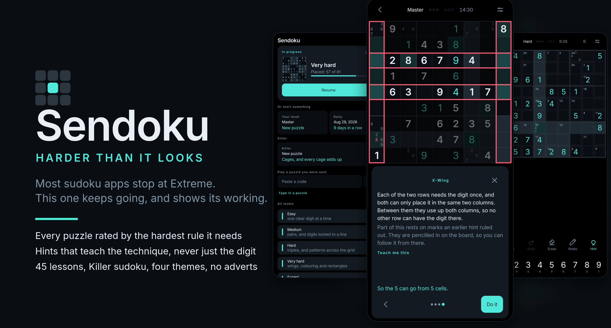
</div>

<div align="center">
  <br/>
  
  
  
  
  
</div>

<br/>

<div align="center">
  <h3>Every sudoku app calls its hardest level Extreme.<br/>Almost none of them can tell you why a puzzle is hard.</h3>
  <p><b>Sendoku can.</b> Every puzzle is solved by a technique solver before you ever see it, so
  it is rated by the hardest human rule it actually needs. That one piece powers the levels, the
  hints, the lessons, and the promise that nothing here ever has to be guessed.</p>
  <p><sub>No adverts. No tracking. No account. No purchases. No internet permission in the manifest.</sub></p>
</div>

<br/>

---

## A hint that teaches you the rule

<table>
<tr>
<td width="42%">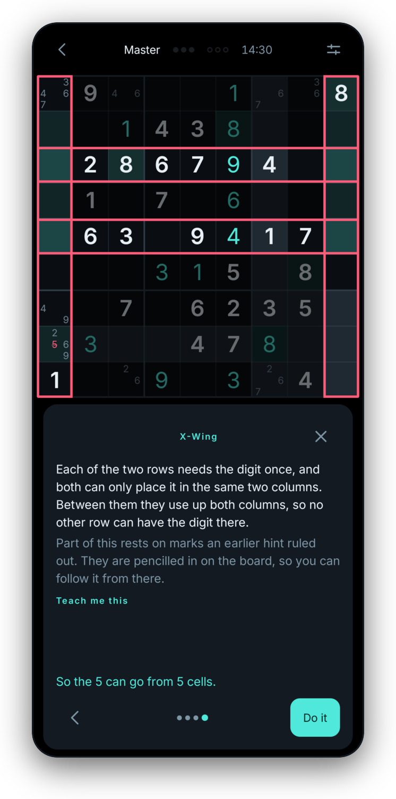</td>
<td valign="top">

### It never just gives you the digit

Ask for help and the app names the technique, draws the cells the logic rests on, writes out
the argument, and only then offers to make the move.

There are four levels of help and you choose how far in you go. **Where should I look?** names
a region and stops there. The next card names the rule. The one after lights the cells. The
last one is the whole argument, with **Do it** beside it.

Every rule it uses has a lesson behind it, one tap away, because a hint you cannot reuse
tomorrow taught you nothing.

</td>
</tr>
</table>

<table>
<tr>
<td valign="top">

### Eight levels, and the top three are real

Easy, Medium, Hard, Very hard, Expert, **Master, Insane, Nightmare**.

The three at the top need a rule that treats a group of cells as one thing, or a cell taken
both ways on paper. They are marked as advanced, because somebody who wanders into one without
knowing that concludes the puzzle is broken rather than hard.

**4,000 puzzles ship inside the app**, rated and filed, and the generator makes more on the
phone when a level runs out. There is no server anywhere in this.

- A daily puzzle chosen by the date, the same grid for everybody, no backend
- Every puzzle carries a code you can send to a friend, five characters for a shipped one
- Type in a puzzle from a newspaper and the app will rate and hint at it

</td>
<td width="42%">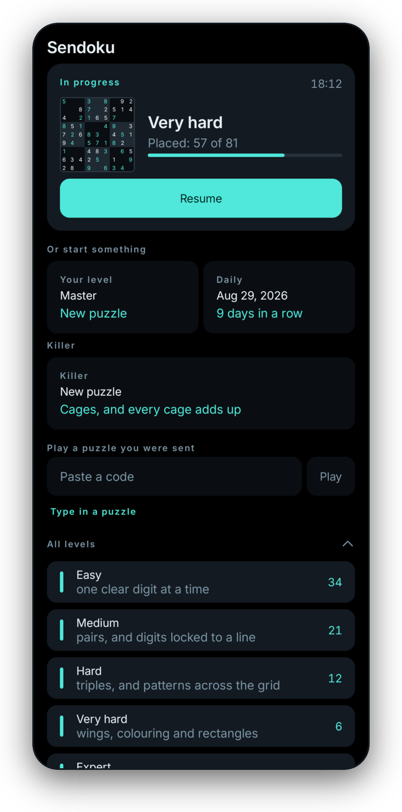</td>
</tr>
</table>

<table>
<tr>
<td width="42%">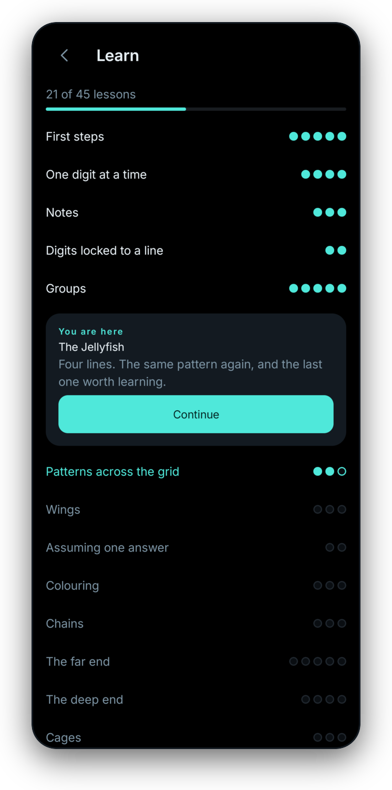</td>
<td valign="top">

### 45 lessons, from what a sudoku is to ALS-XZ

The whole course on one screen, as a map you climb. Thirteen stages, a pip per lesson, and the
next one to do sitting in the middle of the stage you are on.

Lessons are worked on a real board. You are asked to find the thing yourself, told when you are
wrong, and shown it only if you ask. It starts at four by four grids and ends with chains
written out the way they are on paper.

When a lesson is done, **the app can hand you a puzzle that needs exactly that rule**, picked
out of the batch by the same solver that rated it.

</td>
</tr>
</table>

<table>
<tr>
<td valign="top">

### Killer sudoku, rated on the same scale

No clues at all. Cages, sums, and the rule that a cage never repeats a digit.

The rater walks the cage rules and the ordinary ones together, cheapest first, so a Killer gets
a number on the same scale as everything else and the hints know which of the two kinds of
argument to make.

**200 Killers ship in the app**, and three of the course lessons teach the cage rules from
scratch.

</td>
<td width="42%">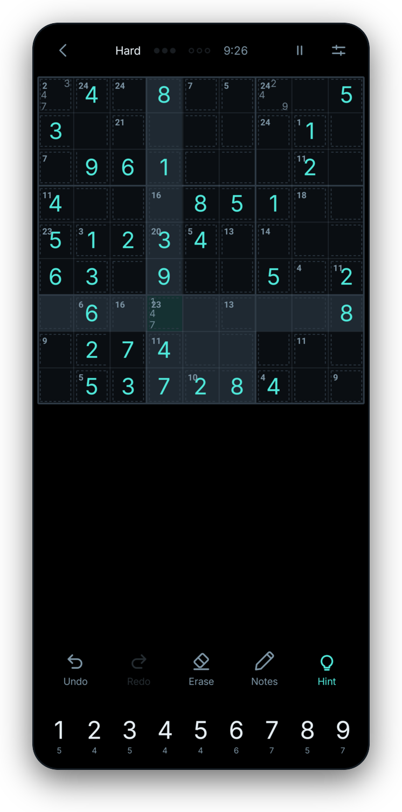</td>
</tr>
</table>

<table>
<tr>
<td width="42%">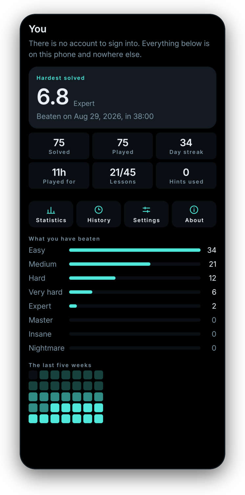</td>
<td valign="top">

### Your record, drawn rather than listed

The hardest puzzle you have ever finished, at the top, with its rating and the day you did it.

Under it, what you have beaten at every level, how far through the course you are, and the last
five weeks as a square per day. All of it is on the phone, in one database, and it never
leaves.

Statistics go further: time per level, clean solves, which rule you have asked for help with
most. That last one is the useful one, and it is the reason the hint log exists at all.

</td>
</tr>
</table>

---

## More of it

<table>
<tr>
<td width="25%" align="center">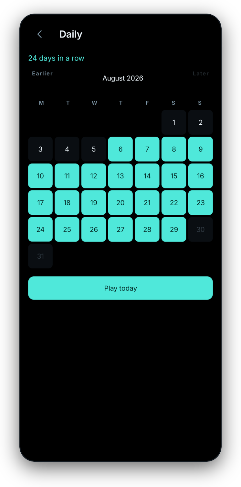<br/><b>A daily, and a streak</b><br/><sub>Chosen by the date, so everybody gets the same grid without a server</sub></td>
<td width="25%" align="center">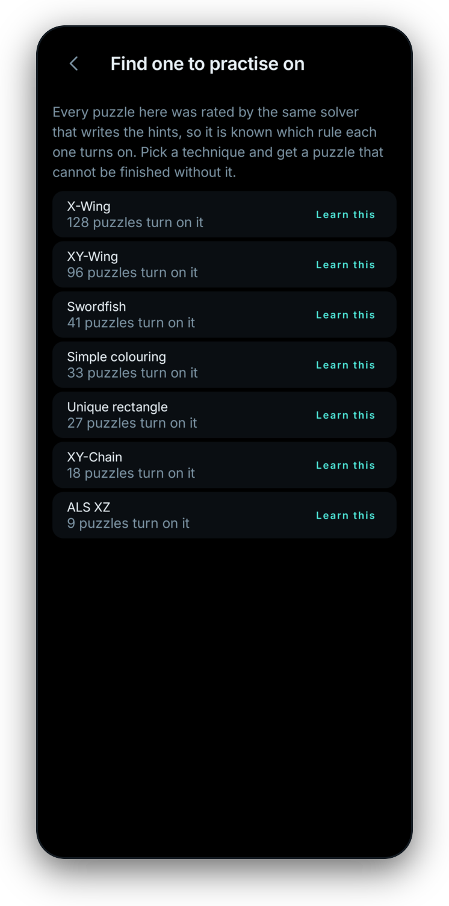<br/><b>Practise one rule</b><br/><sub>Pick a technique and get a puzzle that cannot be finished without it</sub></td>
<td width="25%" align="center">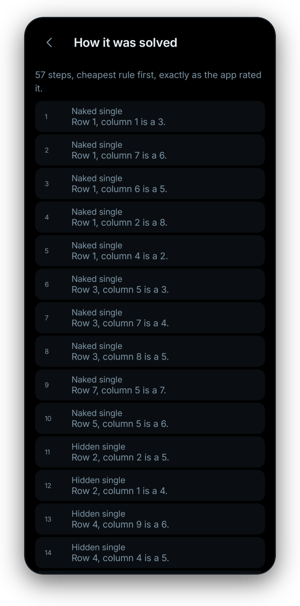<br/><b>The whole solution</b><br/><sub>Every step in order, after a win or a loss, cheapest rule first</sub></td>
<td width="25%" align="center">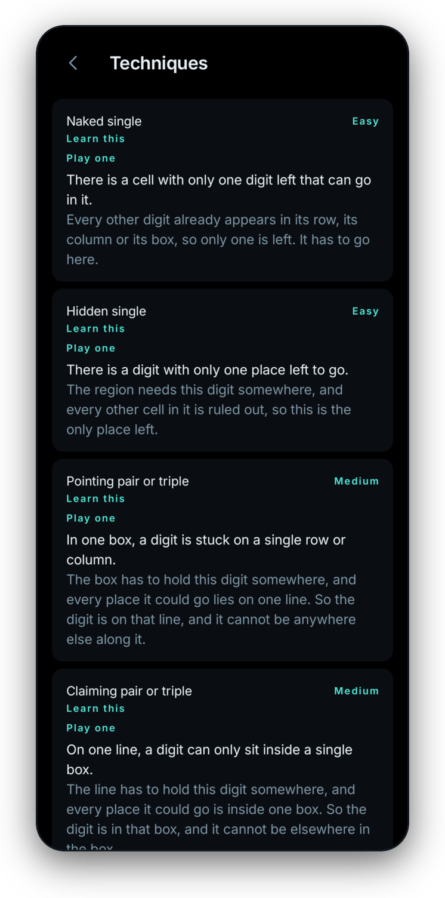<br/><b>Every rule, written down</b><br/><sub>32 techniques explained in a sentence each, with a lesson behind them</sub></td>
</tr>
</table>

<table>
<tr>
<td width="50%" align="center">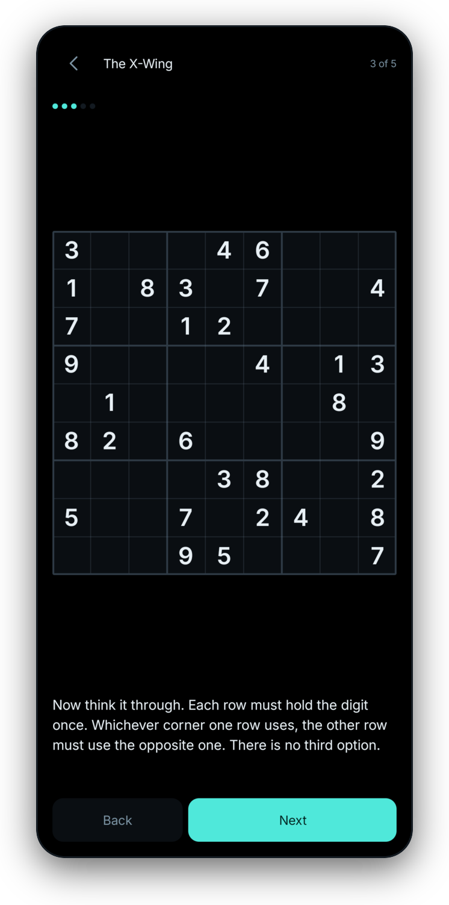<br/><b>Lessons on a real board</b><br/><sub>Find it yourself, get told when you are wrong, see it only if you ask</sub></td>
<td width="50%" align="center">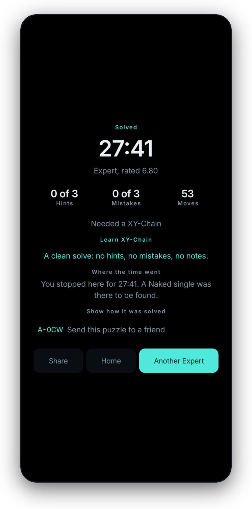<br/><b>What the game cost you</b><br/><sub>Time, mistakes, hints, the hardest rule it needed, and where the time went</sub></td>
</tr>
</table>

---

## Four themes, and each one is a different typeface

<table>
<tr>
<td width="25%" align="center">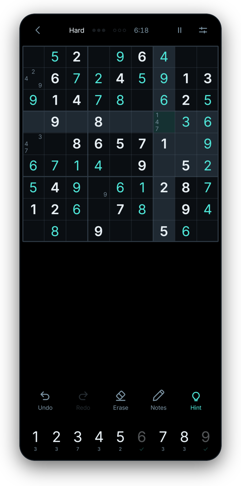<br/><b>Deep Field</b><br/><sub>True black, one cyan accent, Inter</sub></td>
<td width="25%" align="center">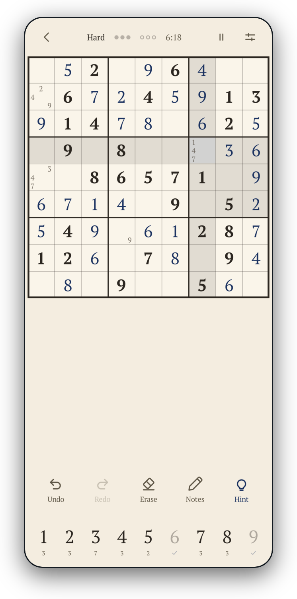<br/><b>Ink and Paper</b><br/><sub>A newspaper puzzle book, PT Serif</sub></td>
<td width="25%" align="center">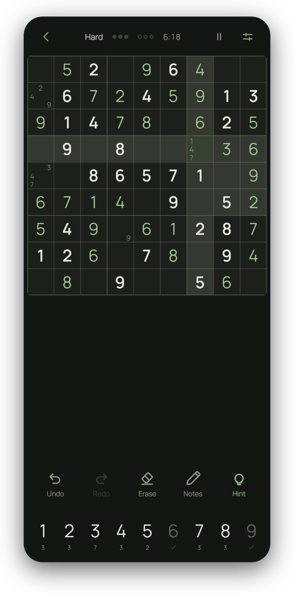<br/><b>Slate Zen</b><br/><sub>Sage and stone, Manrope</sub></td>
<td width="25%" align="center">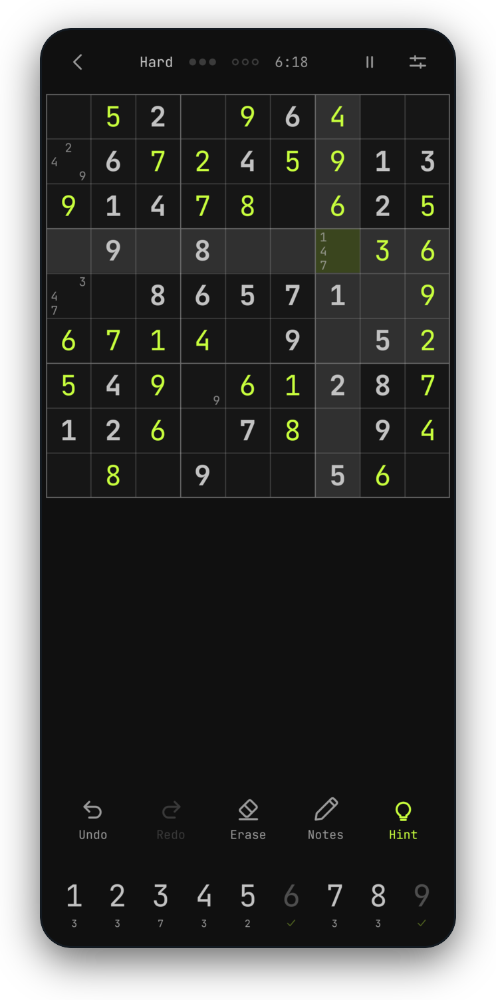<br/><b>Terminal</b><br/><sub>Hard edges, dark only, JetBrains Mono</sub></td>
</tr>
</table>

Each face is cut down to the characters the app can actually draw and nothing else, which is
how eight files, two weights of four families, fit in 260 KB.

<table>
<tr>
<td width="40%">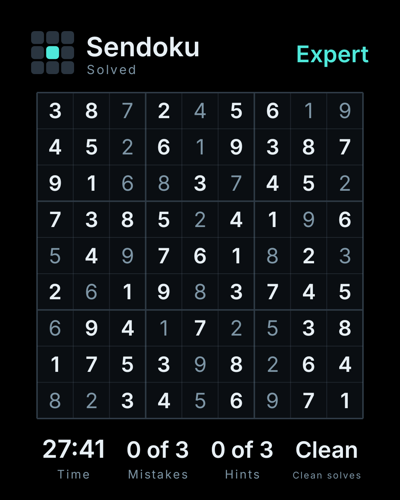</td>
<td valign="top">

### A finished game, as a picture

Drawn on a canvas at 1080 by 1350 rather than screenshotted, so it is sharp on a desktop
monitor and carries no status bar.

The board is on it and it is the point. A row of numbers says somebody finished a puzzle. The
grid says which one, with their own digits brighter than the clues they were given.

It wears whatever theme the player is wearing, and there is nothing on it about the app being
free. Both of those are true and neither belongs on somebody's photograph.

</td>
</tr>
</table>

---

## Built like it matters

| | |
|---|---|
| **Engine** | Pure Kotlin, no Android imports at all. Solver, uniqueness counter, generator, 28 human techniques plus 4 for Killer |
| **App** | Jetpack Compose, Material 3, minSdk 26, one Activity, no fragments |
| **Storage** | Room, on the phone. No account, no cloud, no export unless you ask for one |
| **Puzzles** | 4,000 classic and 200 Killer in a gzipped binary batch, 227 KB for both |
| **Tests** | 681 on the JVM and 179 on a device. The solver and the generator are where a silent bug ships broken puzzles |
| **Size** | 3.1 MB installed, R8 shrunk |
| **Languages** | 12, including Arabic right to left and four scripts Android supplies the font for |

A few decisions worth naming:

- **No internet permission.** Not "we do not collect anything", but the app cannot talk to a
  network at all, which you can check in the built APK rather than take on trust.
- **Hints are free and unlimited if you want them that way.** They are a teaching tool, and
  putting a teaching tool behind an advert would say something about this app that is not true.
- **The grid shape is a constructor argument.** `Dimensions(boxWidth, boxHeight)` means 4x4,
  6x6, 9x9 and 16x16 all work today, and the course uses the small ones to teach on.
- **Difficulty is measured, not asserted.** A level is the hardest rule the solver needed, so
  the ladder cannot drift the way a clue count does.

---

## Building it

Needs JDK 21 and an Android SDK with platform 37.

```sh
export JAVA_HOME=/usr/lib/jvm/java-21-openjdk
./gradlew :engine:fastTest        # the fast loop, about two seconds
./gradlew check detekt :app:lintDebug
./gradlew :app:assembleRelease
```

The screenshots above are generated, not hand made. `./tools/readme-shots.sh` renders every
screen on a device with an instrumented test, and `python3 tools/frame-shots.py` turns them
into the artwork on this page. See [docs/shots/HOW.md](docs/shots/HOW.md).

## Privacy

Nothing is collected, because there is nowhere for it to go. The policy is at
https://adilzhany.github.io/sendoku/privacy.html

## Licence

GNU General Public License version 3, see [LICENSE](LICENSE).

The point of the licence is the point of the app. The source is public so the "no tracking"
claim can be checked, and the copyleft means a repackaged Sendoku with advertisements in it
would have to publish its source too.

<div align="center">
  <br/>
  <sub>Screenshots are the real app, rendered by its own code, not mockups.</sub>
</div>
